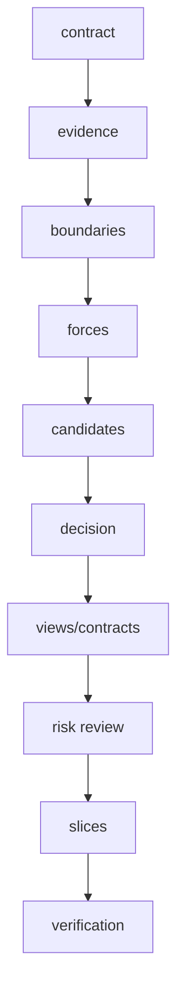
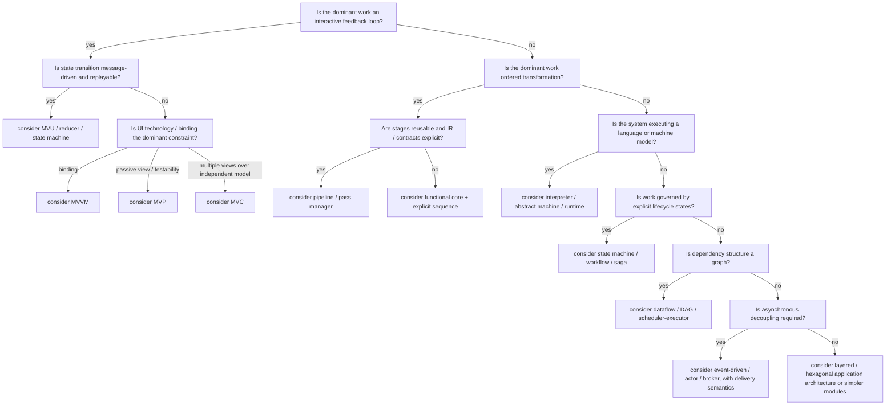

# Architecture Decision Procedure

## Contents

- [1. Rigor-first workflow](#1-rigor-first-workflow)
- [2. Domain classification questions](#2-domain-classification-questions)
- [3. Primary-shape decision tree](#3-primary-shape-decision-tree)
- [4. DDD applicability test](#4-ddd-applicability-test)
- [5. MVC-family applicability test](#5-mvc-family-applicability-test)
- [6. Candidate generation method](#6-candidate-generation-method)
- [7. Weighted decision matrix](#7-weighted-decision-matrix)
- [8. Hard-veto conditions](#8-hard-veto-conditions)
- [9. Quality-attribute scenario review](#9-quality-attribute-scenario-review)
- [10. Lightweight ATAM-style review](#10-lightweight-atam-style-review)
- [11. Component derivation](#11-component-derivation)
- [12. Interface derivation](#12-interface-derivation)
- [13. Concurrency decision procedure](#13-concurrency-decision-procedure)
- [14. Evolution thresholds](#14-evolution-thresholds)
- [15. Architecture review verdicts](#15-architecture-review-verdicts)
- [16. End-to-end workflow and gates](#16-end-to-end-workflow-and-gates)
- [Sources](#sources)

> Locally authored guidance, not a primary source or generated snapshot; source gap: live verification of standards, provider behavior, and other current claims against the bibliography (see `design-09-bibliography.md`) is required before relying on them.

For diagrams intended for GitHub, keep the fenced `mermaid` language marker,
quote punctuation-heavy labels, and write edge labels as `A -->|label| B`.
Use the GitHub Mermaid compatibility note (see `design-09-bibliography.md#github-mermaid-compatibility`)
to probe the target renderer; local rendering is not claimed here.

## 1. Rigor-first workflow

Use the smallest method that still resolves the architectural risk. The default is `R3` unless the task is plainly smaller or the user specifies otherwise. See `design-11-rigor-modes.md`.



A later step may expose an earlier error. Return to the earliest invalid step rather than patching downstream artifacts.

## 2. Domain classification questions

Answer in order:

1. What is the authoritative semantic state or representation?
2. What stimuli enter the system?
3. What component has authority to accept, reject, schedule, or transform them?
4. What outputs are projections versus authoritative state?
5. Which effects leave the deterministic/semantic core?
6. Where do semantics, ownership, trust, transactions, deployment, or failures change?
7. Is the dominant behavior interactive, transformational, interpretive, event-driven, workflow-driven, or dataflow-driven?
8. Which invariants are cross-cutting or cross-boundary?
9. Which qualities are expensive to retrofit?
10. What is the cheapest design that satisfies the evidence?

## 3. Primary-shape decision tree



This tree chooses a primary explanatory shape. Secondary patterns may handle other forces.

## 4. DDD applicability test

Award one point for each established condition:

- Domain rules are a principal source of complexity.
- Domain experts and developers need a precise shared language.
- The same terms have different meanings in different contexts.
- Multiple teams or systems own distinct models.
- Long-lived business/semantic rules must outlast technologies.
- Invariants span multiple operations or entities.
- Integration with legacy/vendor models creates semantic contamination risk.
- Competitive value lies in domain behavior rather than delivery technology.

Interpretation:

- `0–2`: DDD is probably unnecessary; use plain modular design.
- `3–4`: Use selected DDD concepts, usually ubiquitous language and explicit boundaries.
- `5–6`: Strategic DDD is likely useful; evaluate bounded contexts and context mapping.
- `7–8`: Strategic DDD is central; tactical patterns remain optional per context.

This score is advisory. A single severe semantic-boundary problem can justify strategic DDD.

## 5. MVC-family applicability test

All mandatory conditions must hold:

- There is independently meaningful application/semantic state.
- There is at least one representation or projection of that state.
- Inputs are translated into model operations or state transitions.
- Representation and input mechanics are expected to vary independently from some model behavior.

Then select by dominant force:

| Dominant force | Candidate |
| --- | --- |
| Multiple views and classic interactive model | MVC |
| Passive view and presenter testability | MVP |
| Binding platform and observable presentation state | MVVM |
| Deterministic message/state transitions and replay | MVU/reducer |
| Recursive/hierarchical interactive agents | PAC |
| UI-independent screen state | Presentation Model |

Reject MVC language when a pipeline, runtime machine, workflow, or parser model is more precise.

## 6. Candidate generation method

Always create:

- **Baseline:** simplest design that might work.
- **Primary candidate:** best fit to dominant forces.
- **Contrast candidate:** materially different state/control allocation.

Optional fourth candidate:

- **Evolution candidate:** more complex design justified only if a named threshold is crossed.

Example for an agent harness:

1. Single deterministic loop with tools.
2. Orchestrator plus bounded workers and verifier.
3. Durable workflow engine with resumable agent activities.
4. Blackboard multi-agent system only after parallel specialization is proven valuable.

## 7. Weighted decision matrix

Use a 0–5 score:

- `0` violates requirement or cannot satisfy scenario.
- `1` severe weakness; redesign required.
- `2` material weakness; risky mitigation.
- `3` acceptable with known mitigation.
- `4` strong fit.
- `5` directly supports the scenario with evidence.

Recommended criteria:

| Criterion | Default weight |
| --- | ---: |
| Semantic correctness / invariant protection | 5 |
| Goal and requirement fit | 5 |
| Testability / verifiability | 4 |
| Modifiability / extension | 4 |
| Failure recovery / operability | 4 |
| Security / trust isolation | 4 |
| Performance / resource fit | 3 |
| Compatibility / migration | 3 |
| Observability / diagnosability | 3 |
| Implementation complexity | 3 |
| Cognitive load / reviewability | 3 |
| Reversibility | 2 |

Adjust weights only from explicit priorities; record the tradeoff for each adjustment.

Formula:

```text
weighted score = sum(score_i * weight_i) / sum(5 * weight_i)
```

Also apply hard vetoes. A candidate with a requirement violation cannot win by averaging.

## 8. Hard-veto conditions

Reject a candidate when any of these holds without a credible mitigation:

- Violates explicit user constraint or exclusion.
- Creates two authoritative owners for the same state.
- Cannot express or enforce a critical invariant.
- Requires unbounded memory, recursion, retries, queues, or agent loops under expected input.
- Hides irreversible side effects behind non-idempotent retry.
- Crosses a trust boundary without validation and least privilege.
- Cannot be tested except in production.
- Breaks required compatibility or migration path.
- Relies on a framework behavior that is not established.
- Requires semantic agreement across contexts that demonstrably use different meanings.

## 9. Quality-attribute scenario review

For each high-priority scenario, identify:

- Architectural response
- Tactic
- Sensitivity point
- Tradeoff point
- Verification

Example:

```text
QA-REL-03: resume a 6-hour agent run after process loss
Response: persist explicit workflow state and immutable evidence references
Tactic: durable checkpoints + idempotent activities
Sensitivity point: checkpoint granularity
Tradeoff: more writes and schema evolution complexity
Verification: kill process at every activity boundary and assert exactly-once logical result
```

## 10. Lightweight ATAM-style review

### Step A - Business and mission drivers

Record objective, stakeholders, deadlines, compatibility, and irreversible costs.

### Step B - Architecture summary

Describe primary shape, components, connectors, data, runtime, and deployment.

### Step C - Quality tree

Group and prioritize scenarios under correctness, modifiability, performance, reliability, security, usability, and operability.

### Step D - Analyze architectural approaches

For each approach identify:

- Decision
- Assumption
- Sensitivity point
- Tradeoff point
- Risk/non-risk

### Step E - Risk themes

Cluster risks that share a cause, such as:

- hidden state ownership
- uncontrolled asynchronous work
- weak schema/version discipline
- unverifiable semantic transformations
- framework-coupled core logic
- missing cancellation/recovery
- overprivileged tools/plugins

## 11. Component derivation

Derive components from responsibilities and contracts, not nouns.

Bad:

```text
CompilerManager
AgentService
DataHandler
Utils
CoreEngine
```

Better:

```text
SourceSnapshotStore
SemanticAnalyzer
PassScheduler
ToolCapabilityBroker
RunCheckpointRepository
BinaryFrameDecoder
ProjectionRebuilder
```

Each name should imply a bounded responsibility.

## 12. Interface derivation

For each interaction choose one:

- Function/module call
- Command
- Query
- Domain event
- Integration event
- Stream
- Shared immutable value
- Durable job/activity
- Protocol request/response
- Plugin callback

Then specify:

- Schema/type
- Version
- Ownership
- Ordering
- Delivery
- Timeout
- Cancellation
- Idempotency
- Error mapping
- Observability

Introduce queues or events when they provide a named delivery, buffering, ordering, or ownership boundary; record that reason.

## 13. Concurrency decision procedure

1. Identify mutable state.
2. Assign one owner or synchronization protocol.
3. Identify concurrency purpose: throughput, latency hiding, responsiveness, isolation, or distribution.
4. Select model: threads/locks, async tasks, actors, data parallelism, work stealing, event loop, processes.
5. Specify cancellation and shutdown.
6. Bound queues and retries.
7. Define ordering and fairness requirements.
8. Verify races, deadlocks, starvation, replay, and partial failure.

Concurrency without a named benefit is optional complexity.

## 14. Evolution thresholds

Record explicit thresholds that justify a more complex architecture. Examples:

- Add CQRS when read and write models require demonstrably different schemas/scaling/security.
- Add durable workflow when work exceeds process lifetime or needs human approval/compensation.
- Split a bounded context when language, ownership, deployment, or consistency requirements diverge.
- Add multi-agent workers when tasks can be independently verified and parallel speedup exceeds coordination overhead.
- Add a plugin boundary when third-party/independent extension cadence is required.
- Add an IR level when transformations repeatedly lose or reconstruct semantic information.

Without a threshold, "future-proofing" is not sufficient.

## 15. Architecture review verdicts

Use one verdict:

- `PASS` - all mandatory gates pass; risks are accepted and verification exists.
- `REVISE` - architecture is directionally plausible but a failed gate invalidates implementation.
- `BLOCKED` - missing evidence or conflicting constraints prevent a responsible decision.
- `REJECT` - candidate violates a hard requirement or contains an unmitigated veto condition.

There is no advisory or conditional pass. A design with unresolved conditions is
`REVISE` or `BLOCKED`; implementation and acceptance wait for the mandatory
gates. Baselines, exclusions, disabled/advisory modes, threshold overrides, and
exception records cannot change that verdict. Neither can ignore directives,
disabled rules/providers/jobs, lowered severity, `allow-failure`,
`continue-on-error`, excluded paths, altered baselines, or weakened/deleted
tests/checks. Fix failures at the owning cause; a suspected tool defect needs a
minimal reproducer and explicit policy-change authorization while the affected
gate remains blocked.

## 16. End-to-end workflow and gates

Use these phases to order the decision method above. The phase gates keep
repository evidence, topology ownership, and acceptance checks connected; the
candidate matrix, pattern tests, ATAM review, and verdict details remain in
sections 6-10 and 15.

### Phase 0 - Task contract

Extract without embellishment:

- Objective
- Deliverable
- In-scope domains and components
- Explicit constraints and exclusions
- Compatibility requirements
- Required rigor and evidence level
- Definition of done

Assign stable identifiers: `OBJ-*`, `REQ-*`, `CON-*`, `EXC-*`, `QA-*`.

**Gate G0 - Goal integrity:** Trace the proposed work to the user's request;
add objectives only when they are present in the task contract.

### Phase 0a - Candidate tree and topology trigger

Treat creating, splitting, merging, moving, or renaming three or more sibling
source files, or changing package/module/export/directory topology, as
architecture work even when described as a mechanical refactor. Enumerate the
candidate working tree before reading only the indexed diff:

```bash
git status --short
git diff --name-status
git ls-files --others --exclude-standard
```

The untracked-source listing is mandatory. For repository-affecting work, run
the target repository's native capability, dependency, architecture, test, and
build checks before editing and again after editing. Record each exact command,
scope, finding, and exit code in the response. If a required tool or provider is
unavailable, use the narrowest fallback evidence and mark the missing evidence
`UNVERIFIED`; use the repository's existing schema and audit-report path.

### Phase 1 - Evidence and uncertainty

Inspect code, documentation, schemas, logs, tests, standards, and runtime
behavior before inferring architecture. Prefer primary sources and executable
evidence. Classify material statements as `FACT`, `USER`, `INFERRED`, `ASSUMED`,
or `UNKNOWN`, and record the consequence of each assumption if false.

**Gate G1 - Evidence sufficiency:** No high-impact decision depends on an
unlabeled or untestable assumption.

### Phase 1a - Source-topology gate

For a topology trigger, create a source-topology table before proposing a tree
and update it after implementation. Include every changed or newly created
source path, including untracked paths:

| Path | Owner | Change reason | Visibility | Lifecycle | Dependencies | Consolidation rationale |
| --- | --- | --- | --- | --- | --- | --- |

The owner is a durable capability or boundary, not a syntax category. A row
needs a concrete reason the unit cannot be consolidated into its nearest owner.
Reject one-type, one-operation, one-phase, one-helper, and one-validation-per-
file plans when owner, change reason, visibility, lifecycle, dependency set, or
test contract are shared. `Validation`, `Helpers`, `Open`, `Reduce`, and
`Commit` are procedural roles, not durable owners unless an independent
lifecycle, contract, visibility/dependency boundary, or failure policy exists.

**Gate G1a - Topology coherence:** Every candidate source path is mapped,
every split has a consolidation rationale, and no warning/error remains
unresolved. Existing findings stay visible with a disposition; a pre-change
result is comparison context, not a baseline waiver.

### Phase 2 - Domain and boundary model

Identify the problem domain, semantic core, system boundary and actors,
bounded contexts, inputs/outputs/commands/events/queries, mutable-state owners,
and trust, privilege, deployment, and failure boundaries. Use DDD terms only
when they clarify the domain; otherwise use plain boundary, module, state, and
contract language.

**Gate G2 - Boundary coherence:** Every major responsibility has one primary
owner and every cross-boundary interaction has an explicit contract.

### Phase 3 - Architectural forces

Create quality-attribute scenarios as `source -> stimulus -> environment ->
artifact -> response -> measure`. Consider correctness, modifiability,
testability, performance, reliability, security, observability, portability,
operability, and human reviewability; mark non-applicable attributes explicitly.

### Phase 4 - Candidate generation

Generate at least two materially different candidates unless only one is
physically or contractually possible. Candidates differ in responsibility
allocation, control flow, state ownership, or dependency direction, not merely
framework choice. For each, record structural style, state owner, control
authority, dependency direction, I/O model, failure/cancellation behavior,
extension mechanism, benefits, liabilities, and validation evidence.

**Gate G3 - Alternatives:** Include two credible candidates and an explicit
do-less candidate, or a justified impossibility statement. Do-less is a
comparison, not a passing baseline and cannot waive topology or audit findings.

### Phase 5 - Pattern decision

After forces and candidates are explicit, apply sections 6-10 and the pattern
catalog. A selected pattern needs its problem, preconditions, balanced forces,
responsibilities, protected invariants, consequences, introduced failure modes,
rejected alternatives, and replacement threshold.

### Phase 6 - Structural and behavioral specification

Produce the minimum complete set of semantic, static, dynamic, data, runtime,
and deployment views. Critical paths include success, invalid input, dependency
failure, timeout/cancellation, retry/recovery, and partial completion.

**Gate G4 - Flow completeness:** Each critical path has those success and
failure cases represented in its flow and contract.

### Phase 7 - Contracts and invariants

For every major component define purpose, inputs/outputs, pre/postconditions,
invariants, owned state/lifetime, allowed and forbidden dependencies, error
taxonomy, concurrency model, idempotency/replay, observability, security
assumptions, and test seam. Describe each component with its concrete purpose rather than only as `manager`,
`service`, `handler`, `engine`, or `utils`.

### Phase 8 - Tradeoff and risk review

Run the lightweight ATAM review in section 10: rank quality scenarios, identify
sensitivity and tradeoff points, risks/non-risks, unverified assumptions,
mitigations, and validation experiments.

**Gate G5 - Quality fit:** The selected design addresses the highest-ranked
scenarios and exposes its tradeoffs.

### Phase 9 - Decision records and implementation slices

Write an ADR for each architecturally significant decision. Plan vertical
slices proving one real input, semantic validation, state transition, side
effect through a port, observable output, failure path, and automated test.
Keep validation, helpers, open/reduce/commit phases, and one-off types with the
nearest durable owner unless topology evidence proves independent contracts
and lifecycles.

**Gate G6 - Implementability:** Interfaces, ownership, dependency rules, and
first slices are specific enough to implement without inventing architecture
during coding.

### Phase 10 - Verification

Select invariant/property, contract, golden/snapshot, differential,
state-machine, fault-injection, performance, security, and architecture-
conformance checks at the correct level. Audit each check's integrity and keep its
add ignores/exclusions, disable rules/providers/jobs, lower severity or
thresholds, alter baselines, allow failure, exclude paths, or weaken/delete
checks to make results green. Fix the owning cause; if a tool is wrong, leave
the gate enabled and record a minimal reproducer while requesting policy-change
authorization.

**Gate G7 - Verifiability:** Map every critical requirement to an executable
test, inspection, analysis, or monitored measure.

### Phase 11 - Final consistency pass

1. Re-read the objective and exclusions; verify traceability from objective to tests.
2. Search for invented facts, unlabeled assumptions, unsupported pattern names, orphan components, and duplicate state owners.
3. Check failure, cancellation, migration, rollback, and source-topology coverage for tracked and untracked candidates.
4. Audit check/CI configuration for suppression directives, disabled rules/providers/jobs, severity/threshold/baseline edits, allow-failure, excluded paths, or weakened/deleted tests.
5. Rerun the target repository's unmodified native architecture, test, and build checks when files changed; acceptance requires zero unresolved warnings or errors.
6. Run bundled validators and record exact commands, scopes, active checks, exit codes, and artifact paths.

## Sources

- Package bibliography (see `design-09-bibliography.md`); verify the linked source record before relying on current or external claims.
