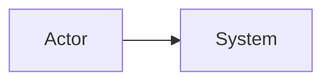
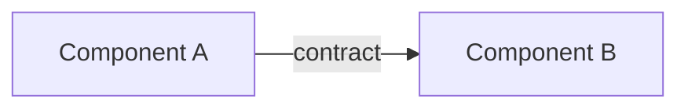
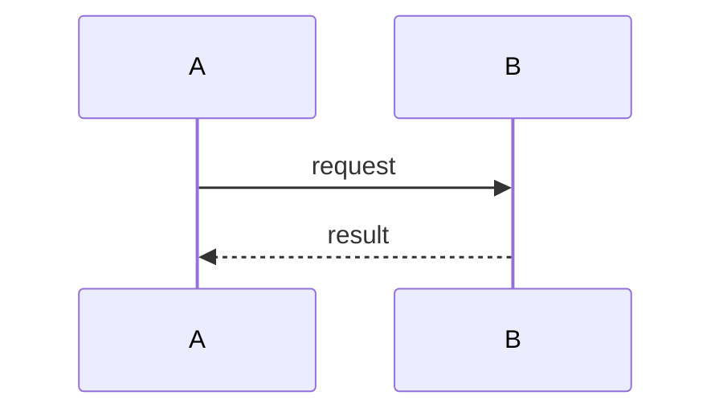

# Architecture Report: <System / Decision>

- Date: <YYYY-MM-DD>
- Status: Draft | Review | Accepted | Superseded
- Rigor: R0 | R1 | R2 | R3 | R4
- Authors / reviewers: <names or roles>

## 1. Task Contract

### Objective

- `OBJ-001` - <objective>

### Requirements

- `REQ-001` - <requirement>

### Constraints

- `CON-001` - <constraint>

### Explicit exclusions

- `EXC-001` - <not in scope>

### Definition of done

<observable completion criteria>

## 2. Evidence and Unknowns

| ID | Class | Claim | Source / observation | Impact |
|---|---|---|---|---|
| E-001 | FACT / USER / INFERRED / ASSUMED / UNKNOWN | | | |

## 3. Domain and Boundary Model

### Vocabulary

| Term | Definition | Authority / context | Forbidden ambiguous uses |
|---|---|---|---|
| | | | |

### Boundaries and state owners

| Boundary / context | Responsibility | State owned | External contracts |
|---|---|---|---|
| | | | |

### Context / system diagram

## 4. Quality-Attribute Scenarios

| ID | Source | Stimulus | Environment | Artifact | Response | Measure | Priority |
|---|---|---|---|---|---|---|---|
| QA-001 | | | | | | | |

## 5. Candidate Architectures

### Candidate A - Do-less baseline

- State owner:
- Control authority:
- Dependency direction:
- Success behavior:
- Failure/cancellation/recovery:
- Benefits:
- Liabilities:
- Validation evidence:

### Candidate B - <name>

<same fields>

### Candidate C - <name>

<same fields>

## 6. Decision Matrix

| Criterion | Weight | Baseline | Candidate B | Candidate C | Evidence / uncertainty |
|---|---:|---:|---:|---:|---|
| | | | | | |

### Hard vetoes

- <candidate>: <violated invariant or constraint>

## 7. Selected Architecture and Consequences

- Decision:
- Pattern(s) and tactics:
- Problem solved here:
- Preconditions:
- Accepted disadvantages:
- New risks:
- Rejected alternatives:
- Exit / replacement criteria:

## 8. Static Structure

### Dependency rules

1. <rule>
2. <forbidden dependency>

## 9. Critical Flows

### Flow F-001 - Success

### Flow F-002 - Invalid input

<diagram and expected response>

### Flow F-003 - Dependency failure

<diagram and expected response>

### Flow F-004 - Timeout or cancellation

<diagram and expected response>

### Flow F-005 - Recovery or partial completion

<diagram and expected response>

## 10. Component Contracts and Invariants

### CMP-001 - <component>

- Purpose:
- Inputs:
- Outputs:
- Preconditions:
- Postconditions:
- Invariants:
- State and lifetime:
- Dependencies:
- Forbidden dependencies:
- Errors:
- Concurrency:
- Idempotency/replay:
- Observability:
- Security assumptions:
- Test seam:

## 11. Data and Runtime Model

### Data ownership, consistency, and migration

<schemas, ownership, serialization, versions, migration, retention>

### Processes, tasks, scheduling, and backpressure

<runtime topology and resource limits>

### Deployment, trust, and recovery

<trust zones, persistence, external services, backup/restore>

## 12. Risks and Tradeoffs

| ID | Type | Trigger | Effect | Mitigation | Detection | Owner |
|---|---|---|---|---|---|---|
| RISK-001 | Risk / sensitivity / tradeoff / non-risk | | | | | |

## 13. ADR Index

| ADR | Decision | Status | Related requirements |
|---|---|---|---|
| ADR-001 | | | |

## 14. Implementation Slices

| Slice | Architectural question proved | Input | State/transform | Side effect | Output | Failure test |
|---|---|---|---|---|---|---|
| VS-001 | | | | | | |

## 15. Verification and Traceability

| Requirement / QA | Decision | Component / flow | Verification | Status |
|---|---|---|---|---|
| REQ-001 | ADR-001 | CMP-001 / F-001 | TEST-001 | Planned |

## 16. Deferred / Out of Scope

- <item and reason>

## 17. Blocking Questions

- <only questions that materially block a gate>
