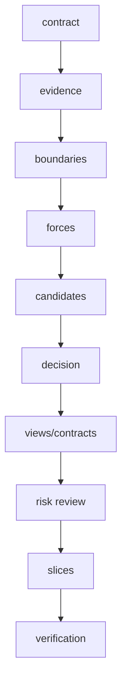
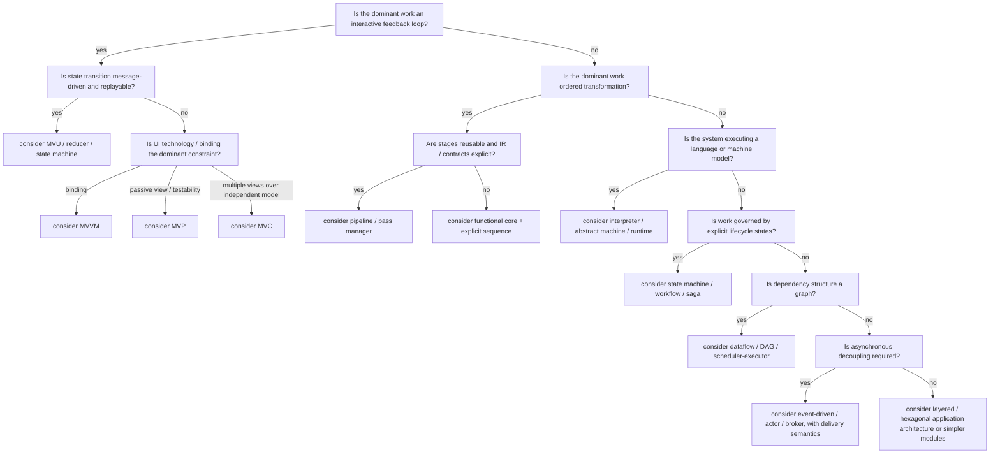

# Architecture Decision Procedure

## 1. Rigor-first workflow

Use the smallest method that still resolves the architectural risk. The default is `R3` unless the task is plainly smaller or the user specifies otherwise. See `references/11-rigor-modes.md`.



A later step may expose an earlier error. Return to the earliest invalid step rather than patching downstream artifacts.

## 2. Domain classification questions

Answer in order:

1. What is the authoritative semantic state or representation?
2. What stimuli enter the system?
3. What component has authority to accept, reject, schedule, or transform them?
4. What outputs are projections versus authoritative state?
5. Which effects leave the deterministic/semantic core?
6. Where do semantics, ownership, trust, transactions, deployment, or failures change?
7. Is the dominant behavior interactive, transformational, interpretive, event-driven, workflow-driven, or dataflow-driven?
8. Which invariants are cross-cutting or cross-boundary?
9. Which qualities are expensive to retrofit?
10. What is the cheapest design that satisfies the evidence?

## 3. Primary-shape decision tree



This tree chooses a primary explanatory shape. Secondary patterns may handle other forces.

## 4. DDD applicability test

Award one point for each established condition:

- Domain rules are a principal source of complexity.
- Domain experts and developers need a precise shared language.
- The same terms have different meanings in different contexts.
- Multiple teams or systems own distinct models.
- Long-lived business/semantic rules must outlast technologies.
- Invariants span multiple operations or entities.
- Integration with legacy/vendor models creates semantic contamination risk.
- Competitive value lies in domain behavior rather than delivery technology.

Interpretation:

- `0–2`: DDD is probably unnecessary; use plain modular design.
- `3–4`: Use selected DDD concepts, usually ubiquitous language and explicit boundaries.
- `5–6`: Strategic DDD is likely useful; evaluate bounded contexts and context mapping.
- `7–8`: Strategic DDD is central; tactical patterns remain optional per context.

This score is advisory. A single severe semantic-boundary problem can justify strategic DDD.

## 5. MVC-family applicability test

All mandatory conditions must hold:

- There is independently meaningful application/semantic state.
- There is at least one representation or projection of that state.
- Inputs are translated into model operations or state transitions.
- Representation and input mechanics are expected to vary independently from some model behavior.

Then select by dominant force:

| Dominant force | Candidate |
| --- | --- |
| Multiple views and classic interactive model | MVC |
| Passive view and presenter testability | MVP |
| Binding platform and observable presentation state | MVVM |
| Deterministic message/state transitions and replay | MVU/reducer |
| Recursive/hierarchical interactive agents | PAC |
| UI-independent screen state | Presentation Model |

Reject MVC language when a pipeline, runtime machine, workflow, or parser model is more precise.

## 6. Candidate generation method

Always create:

- **Baseline:** simplest design that might work.
- **Primary candidate:** best fit to dominant forces.
- **Contrast candidate:** materially different state/control allocation.

Optional fourth candidate:

- **Evolution candidate:** more complex design justified only if a named threshold is crossed.

Example for an agent harness:

1. Single deterministic loop with tools.
2. Orchestrator plus bounded workers and verifier.
3. Durable workflow engine with resumable agent activities.
4. Blackboard multi-agent system only after parallel specialization is proven valuable.

## 7. Weighted decision matrix

Use a 0–5 score:

- `0` violates requirement or cannot satisfy scenario.
- `1` severe weakness; redesign required.
- `2` material weakness; risky mitigation.
- `3` acceptable with known mitigation.
- `4` strong fit.
- `5` directly supports the scenario with evidence.

Recommended criteria:

| Criterion | Default weight |
| --- | ---: |
| Semantic correctness / invariant protection | 5 |
| Goal and requirement fit | 5 |
| Testability / verifiability | 4 |
| Modifiability / extension | 4 |
| Failure recovery / operability | 4 |
| Security / trust isolation | 4 |
| Performance / resource fit | 3 |
| Compatibility / migration | 3 |
| Observability / diagnosability | 3 |
| Implementation complexity | 3 |
| Cognitive load / reviewability | 3 |
| Reversibility | 2 |

Adjust weights only from explicit priorities. Do not manipulate weights to justify a favorite.

Formula:

```text
weighted score = sum(score_i * weight_i) / sum(5 * weight_i)
```

Also apply hard vetoes. A candidate with a requirement violation cannot win by averaging.

## 8. Hard-veto conditions

Reject a candidate when any of these holds without a credible mitigation:

- Violates explicit user constraint or exclusion.
- Creates two authoritative owners for the same state.
- Cannot express or enforce a critical invariant.
- Requires unbounded memory, recursion, retries, queues, or agent loops under expected input.
- Hides irreversible side effects behind non-idempotent retry.
- Crosses a trust boundary without validation and least privilege.
- Cannot be tested except in production.
- Breaks required compatibility or migration path.
- Relies on a framework behavior that is not established.
- Requires semantic agreement across contexts that demonstrably use different meanings.

## 9. Quality-attribute scenario review

For each high-priority scenario, identify:

- Architectural response
- Tactic
- Sensitivity point
- Tradeoff point
- Verification

Example:

```text
QA-REL-03: resume a 6-hour agent run after process loss
Response: persist explicit workflow state and immutable evidence references
Tactic: durable checkpoints + idempotent activities
Sensitivity point: checkpoint granularity
Tradeoff: more writes and schema evolution complexity
Verification: kill process at every activity boundary and assert exactly-once logical result
```

## 10. Lightweight ATAM-style review

### Step A - Business and mission drivers

Record objective, stakeholders, deadlines, compatibility, and irreversible costs.

### Step B - Architecture summary

Describe primary shape, components, connectors, data, runtime, and deployment.

### Step C - Quality tree

Group and prioritize scenarios under correctness, modifiability, performance, reliability, security, usability, and operability.

### Step D - Analyze architectural approaches

For each approach identify:

- Decision
- Assumption
- Sensitivity point
- Tradeoff point
- Risk/non-risk

### Step E - Risk themes

Cluster risks that share a cause, such as:

- hidden state ownership
- uncontrolled asynchronous work
- weak schema/version discipline
- unverifiable semantic transformations
- framework-coupled core logic
- missing cancellation/recovery
- overprivileged tools/plugins

## 11. Component derivation

Derive components from responsibilities and contracts, not nouns.

Bad:

```text
CompilerManager
AgentService
DataHandler
Utils
CoreEngine
```

Better:

```text
SourceSnapshotStore
SemanticAnalyzer
PassScheduler
ToolCapabilityBroker
RunCheckpointRepository
BinaryFrameDecoder
ProjectionRebuilder
```

Each name should imply a bounded responsibility.

## 12. Interface derivation

For each interaction choose one:

- Function/module call
- Command
- Query
- Domain event
- Integration event
- Stream
- Shared immutable value
- Durable job/activity
- Protocol request/response
- Plugin callback

Then specify:

- Schema/type
- Version
- Ownership
- Ordering
- Delivery
- Timeout
- Cancellation
- Idempotency
- Error mapping
- Observability

Do not introduce queues or events solely to “decouple” code.

## 13. Concurrency decision procedure

1. Identify mutable state.
2. Assign one owner or synchronization protocol.
3. Identify concurrency purpose: throughput, latency hiding, responsiveness, isolation, or distribution.
4. Select model: threads/locks, async tasks, actors, data parallelism, work stealing, event loop, processes.
5. Specify cancellation and shutdown.
6. Bound queues and retries.
7. Define ordering and fairness requirements.
8. Verify races, deadlocks, starvation, replay, and partial failure.

Concurrency without a named benefit is optional complexity.

## 14. Evolution thresholds

Record explicit thresholds that justify a more complex architecture. Examples:

- Add CQRS when read and write models require demonstrably different schemas/scaling/security.
- Add durable workflow when work exceeds process lifetime or needs human approval/compensation.
- Split a bounded context when language, ownership, deployment, or consistency requirements diverge.
- Add multi-agent workers when tasks can be independently verified and parallel speedup exceeds coordination overhead.
- Add a plugin boundary when third-party/independent extension cadence is required.
- Add an IR level when transformations repeatedly lose or reconstruct semantic information.

Without a threshold, “future-proofing” is not sufficient.

## 15. Architecture review verdicts

Use one verdict:

- `PASS` - all mandatory gates pass; risks are accepted and verification exists.
- `PASS WITH CONDITIONS` - implementation may start only on listed safe slices while conditions are resolved.
- `REVISE` - architecture is directionally plausible but a failed gate invalidates implementation.
- `BLOCKED` - missing evidence or conflicting constraints prevent a responsible decision.
- `REJECT` - candidate violates a hard requirement or contains an unmitigated veto condition.
