# Canonical Flowgraphs

> Locally authored diagram guidance, not a primary source or generated snapshot; source gap: live verification of renderer behavior through the [bibliography](09-bibliography.md) is required before relying on syntax or architecture claims.

GitHub renders Mermaid from a fenced `mermaid` block using a
version-dependent renderer. Use `flowchart` with stable IDs, quote labels that
contain punctuation, and use `A -->|label| B` for labeled edges. Probe the
target renderer with an `info` diagram as described in the
[GitHub Mermaid compatibility note](09-bibliography.md#github-mermaid-compatibility);
no local render result is claimed here.

All diagrams use Mermaid. Adapt names to the actual system. Do not copy a graph without checking state ownership, control authority, and failure paths.

## 1. Master architecture workflow

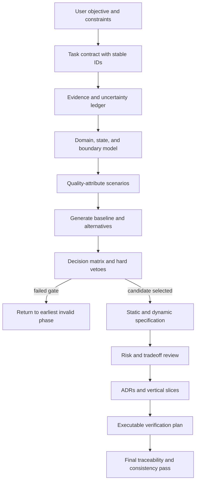

## 2. Gate state machine

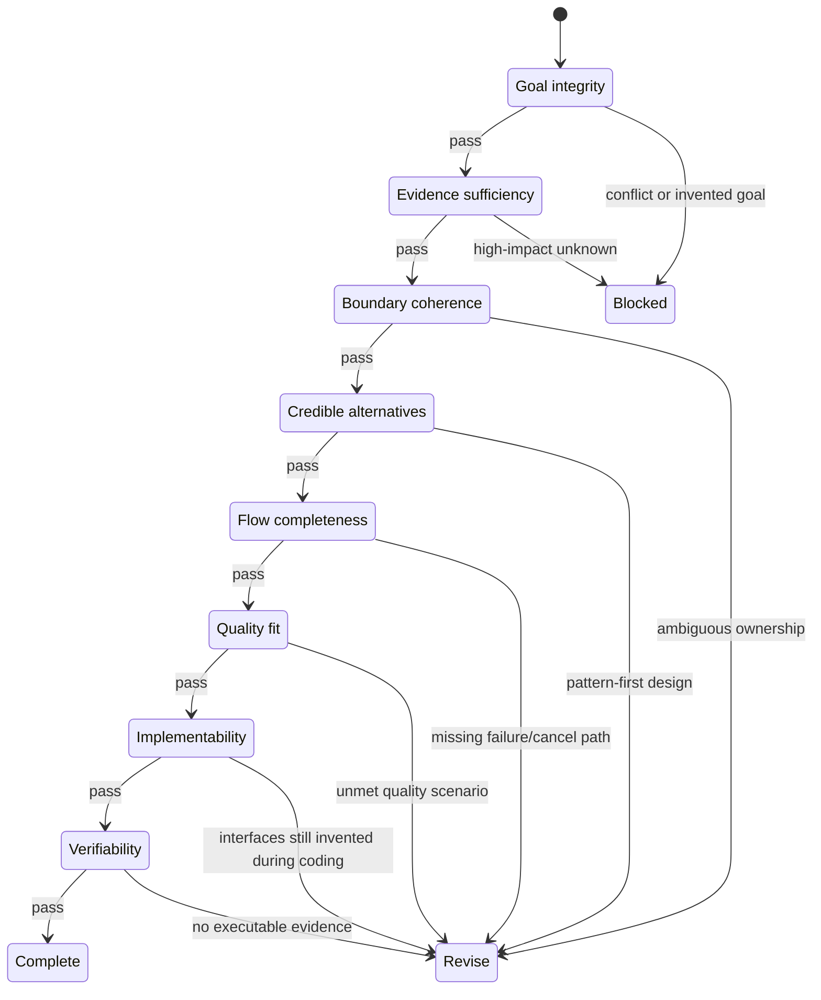

## 3. Classic MVC-style interaction

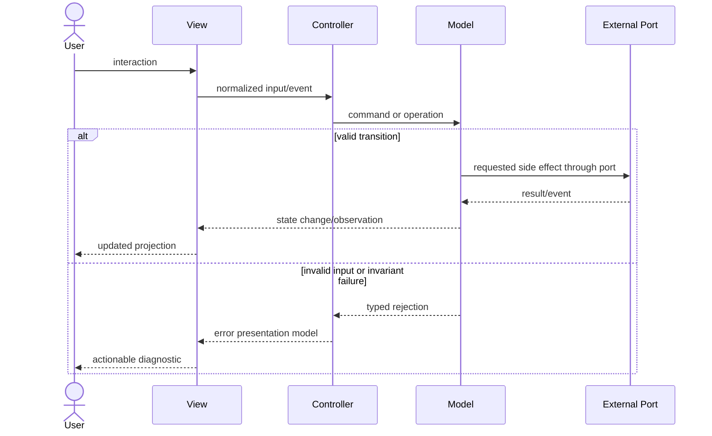

## 4. MVU / reducer loop

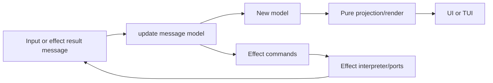

## 5. DDD bounded-context interaction

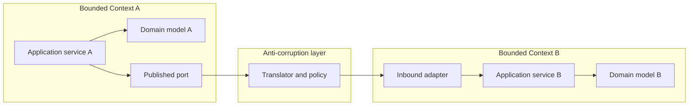

## 6. Batch compiler

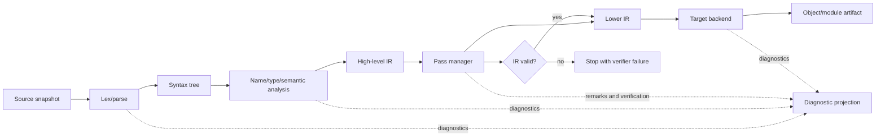

## 7. Incremental compiler / language server

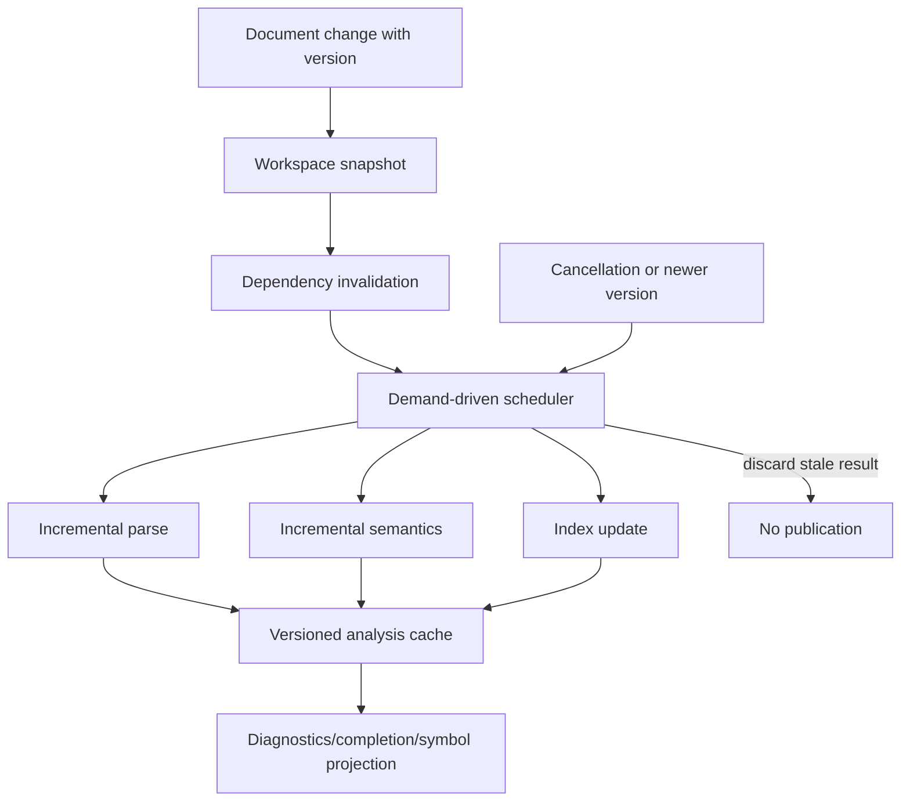

## 8. Interpreter / abstract machine

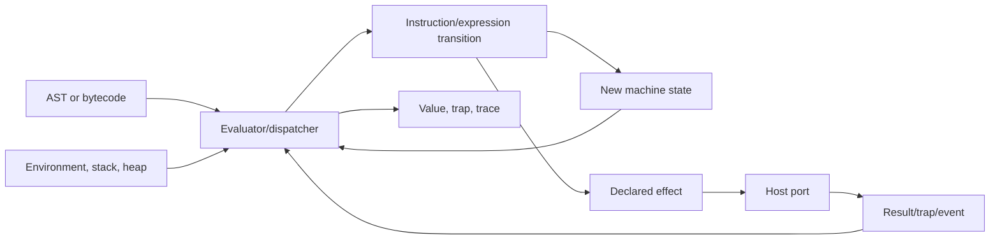

## 9. Runtime with JIT feedback

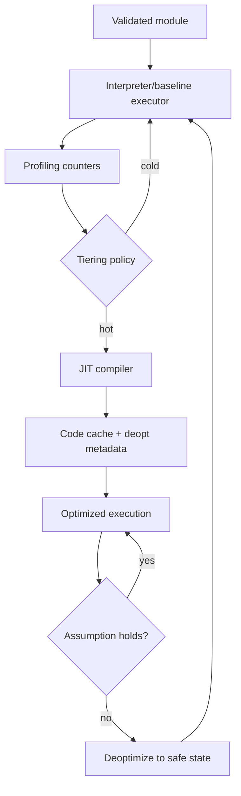

## 10. Non-interactive CLI

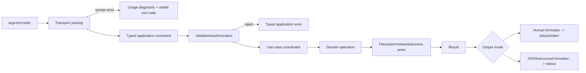

## 11. TUI

```mermaid
sequenceDiagram
    participant Term as Terminal/Input
    participant Loop as Event Loop
    participant Update
    participant Model
    participant Effect as Effect Ports
    participant Render

    Term->>Loop: key/mouse/resize/timer
    Loop->>Update: message + current model
    Update->>Model: produce next immutable state
    Update->>Effect: commands
    Model->>Render: project state
    Render-->>Term: terminal frame
    Effect-->>Loop: completion/error message
```

## 12. Agent harness

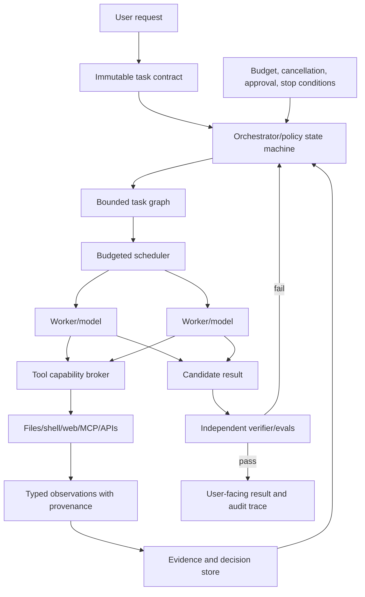

## 13. Long-running agent recovery

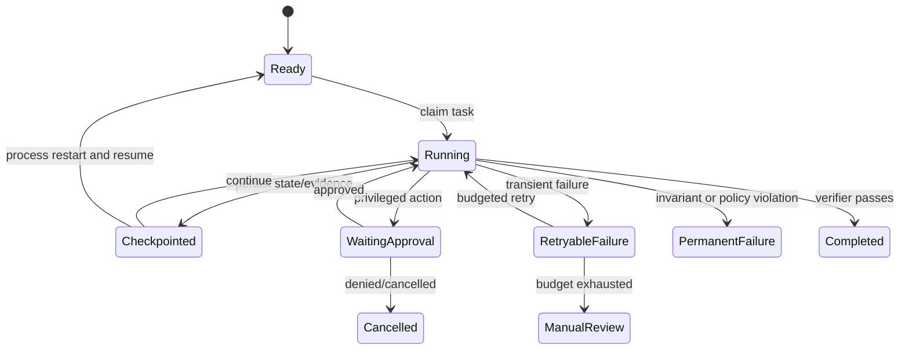

## 14. Web API through ports and adapters

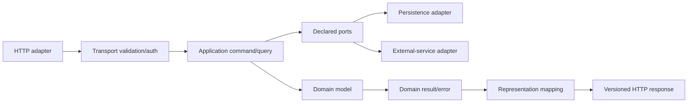

## 15. Binary parser with staged trust

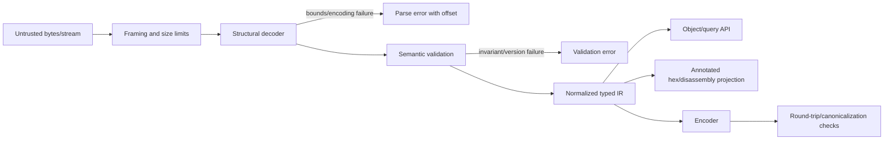

## 16. Event-driven service

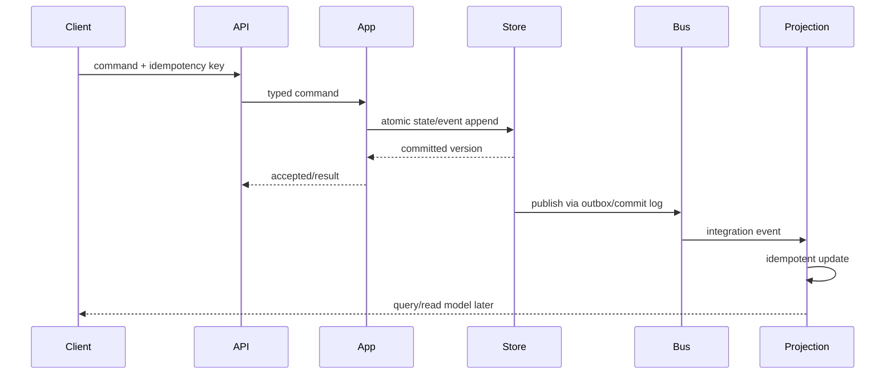

## 17. Durable workflow / saga

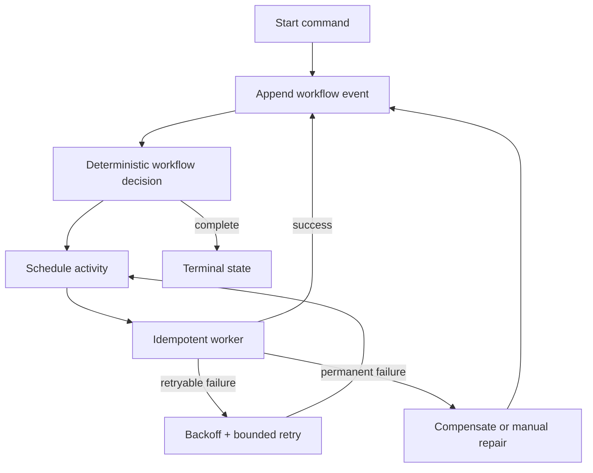

## 18. Vertical architecture slice

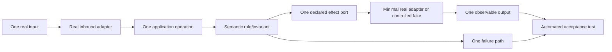

## 19. Contradiction resolution

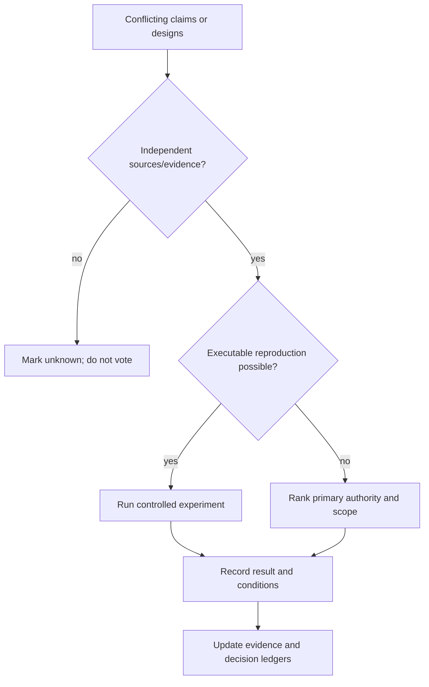

## Sources

- [Package bibliography](09-bibliography.md); verify the linked source record before relying on current or external claims.
