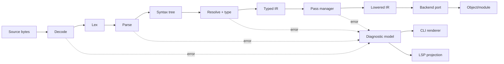
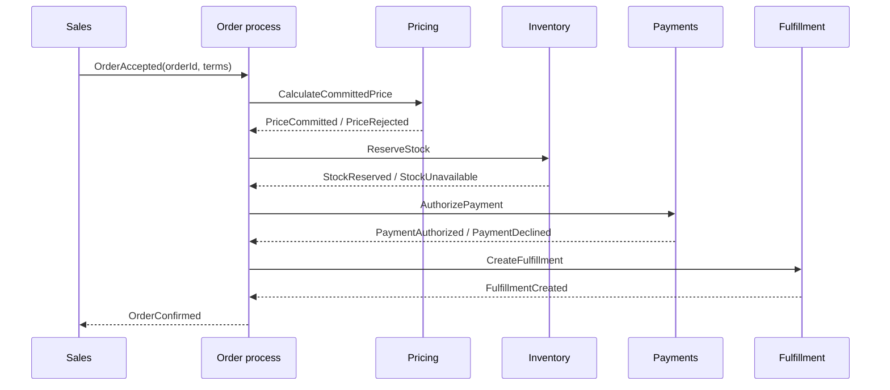

# Worked Examples

These examples demonstrate the decision procedure. They are not blueprints. Re-run the gates for the actual system and record where the analogy fails.

---

## Example A - Extensible compiler toolchain

### Task contract

Build a compiler that accepts one source language, supports multiple target backends, exposes diagnostics to CLI and language-server clients, and permits independently developed optimization passes.

### Dominant forces

- Semantic correctness and reproducibility
- Clear phase contracts
- Extensibility without arbitrary pass coupling
- Diagnostic source mapping
- Deterministic testing
- Backend independence

### Candidates

1. **Monolithic compiler object** - parser, type checker, optimizer, and emitter mutate shared state.
2. **Typed IR pipeline with pass manager** - each phase consumes/produces explicit representations; analyses are declared and invalidated.
3. **Event-bus compiler** - stages react to compilation events.

### Decision

Select a typed IR pipeline with a pass manager. The monolith is the baseline and may be adequate for a tiny language; the event bus obscures ordering and data dependencies.

### Responsibility mapping

| Concern | Owner |
| --- | --- |
| Source text and spans | Source manager |
| Syntax | Parser and syntax tree |
| Name/type semantics | Semantic analyzer and symbol environment |
| Lowered program meaning | Typed IR dialects |
| Transformation ordering | Pass manager |
| Cached analyses | Analysis manager |
| Machine-specific lowering | Backend adapter |
| Human-facing diagnostics | Diagnostic renderer/projection |

### Why this is not MVC

Diagnostics are projections, but the dominant architecture is a transformation pipeline. Calling the compiler MVC would hide the representation contracts, phase ordering, and analysis invalidation that actually control correctness.

### Critical flow



### Invariants

- Every IR operation is valid for its declared dialect after its producing phase.
- A pass may access only declared analyses and must invalidate stale analyses.
- Diagnostics preserve source identity and span provenance.
- Backends depend on lowered IR contracts, not parser internals.

### First vertical slice

Compile one integer-expression file through parse, type check, one constant-folding pass, and one textual backend; emit one structured diagnostic for invalid input; compare output with a golden file.

### Exit criteria

Replace the in-process pass manager when untrusted plugins require process isolation or when distributed compilation justifies a remote execution boundary.

---

## Example B - Stateful package-manager TUI

### Task contract

Create a terminal interface that searches packages, builds an install plan, asks for confirmation, executes operations, displays progress, and supports cancellation and recovery.

### Dominant forces

- One authoritative UI state
- Deterministic event processing
- Background I/O without display corruption
- Cancellation and resumability
- Testable rendering

### Candidates

1. Callback-heavy widgets with mutable shared state.
2. MVC with controllers per screen.
3. MVU/state machine: immutable model, messages, update function, commands, and pure view.

### Decision

Select MVU plus explicit effect commands. It gives one state transition authority and makes event replay and snapshot testing straightforward.

### Responsibility mapping

| Role | Concrete element |
| --- | --- |
| Model | UI state, query, selection, plan, execution status |
| Update/controller | `update(model, message) -> model, commands` |
| View | Pure terminal tree/layout derived from model |
| Effects | Package index, resolver, installer, filesystem ports |
| Event source | Keyboard, resize, timers, effect completions |

### Critical flow

```mermaid
sequenceDiagram
  participant U as User
  participant Loop as Event loop
  participant Upd as Update
  participant Eff as Effect runner
  participant Pkg as Package port
  participant View as Renderer
  U->>Loop: ConfirmInstall
  Loop->>Upd: message + current model
  Upd-->>Loop: Executing model + StartInstall command
  Loop->>View: render(model)
  Loop->>Eff: StartInstall(plan, cancelToken)
  Eff->>Pkg: execute(plan)
  Pkg-->>Eff: progress/result
  Eff-->>Loop: InstallProgress / InstallFinished
  Loop->>Upd: completion message
  Upd-->>Loop: updated model
  Loop->>View: render(model)
```

### Invariants

- Only the update function changes model state.
- Effects cannot mutate UI state directly.
- Every in-flight operation has a stable operation ID and cancellation token.
- A completion for a superseded operation is ignored or reconciled explicitly.

### Failure path

A network failure yields `InstallFailed(operationId, classifiedError)`. The update function preserves the plan, records resumable progress, and exposes retry/rollback actions. It does not silently restart.

---

## Example C - Binary protocol inspector and editor

### Task contract

Decode, validate, display, modify, and re-encode a versioned binary container while preserving unknown extension fields.

### Dominant forces

- Byte-for-byte correctness
- Bounds safety
- Version compatibility
- Separation of syntax and semantics
- Round-trip preservation
- Explainable offsets and errors

### Candidates

1. Direct cursor reads into mutable domain objects.
2. Declarative schema-generated parser only.
3. Layered decode: byte source -> structural parse tree -> validation -> semantic model -> projection/edit commands -> encoder.

### Decision

Select layered decode with a lossless structural representation and a validated semantic projection. Use schema generation where it can preserve offsets and unknown fields; do not make generated classes the domain model by default.

### Responsibility mapping

| Layer | Responsibility |
| --- | --- |
| Byte source | Bounded reads, endianness, offset tracking |
| Structural decoder | Tags, lengths, nesting, raw unknown fields |
| Validator | Cross-field rules, checksums, version constraints |
| Semantic mapper | Meaningful concepts and invariants |
| Projection | Hex/tree/table representation |
| Edit command handler | Valid semantic or structural mutations |
| Encoder | Canonical or preservation-mode serialization |

### Critical flow

```mermaid
flowchart TD
  B[Bytes] --> R[Bounded reader]
  R --> S[Lossless structural tree]
  S --> V{Valid?}
  V - no --> E[Offset-aware error model]
  V - yes --> M[Semantic model]
  M --> P[UI/CLI projection]
  P --> C[Edit command]
  C --> M2[Validated semantic state]
  M2 --> ENC[Encoder]
  S -.unknown raw fields.-> ENC
  ENC --> B2[Output bytes]
```

### Invariants

- No read advances beyond the containing region.
- Every decoded field retains source offset and encoded width where preservation mode needs it.
- Unknown fields survive unmodified round trips.
- Semantic edits cannot produce structurally invalid lengths or checksums.

### Verification

- Property: decode(encode(validModel)) is semantically equivalent.
- Preservation property: encode(decode(bytes), preserve) equals input for supported unchanged files.
- Differential tests against a known implementation.
- Fuzzing of lengths, recursion depth, and malformed tags.

---

## Example D - Tool-using AI agent harness

### Task contract

Run long software-engineering tasks with model/effort switching, multiple workers, persistent progress, bounded side effects, and recovery after context compaction or process restart.

### Dominant forces

- Goal fidelity across long horizons
- Evidence-grounded decisions
- Controlled delegation
- Idempotent/recoverable actions
- Token and tool budget governance
- Human review at irreversible boundaries
- Traceable execution

### Candidates

1. One unconstrained conversational agent with all tools.
2. Peer swarm where agents negotiate and act independently.
3. Governed orchestrator with typed task state, bounded workers, capability-scoped tools, event log, checkpoints, and policy gates.

### Decision

Select the governed orchestrator. Peer swarms may explore in parallel but MUST NOT own independent final goals or irreversible authority.

### Structural mapping

| Concern | Owner |
| --- | --- |
| User goal and exclusions | Goal contract store |
| Current plan and task graph | Orchestrator |
| Worker assignment | Scheduler/router |
| Model/effort selection | Policy using task risk and budget |
| Tool permissions | Capability broker |
| Evidence | Provenance store |
| Durable progress | Checkpoint/event store |
| Human-readable status | Observation renderer |
| Validation | Independent verifier/gates |

### Why this is only MVC-like

The durable task state resembles a model and the status renderer resembles a view, but the central force is governed workflow execution. The correct primary names are orchestrator, state store, policy, workers, capability broker, and verifier--not generic MVC labels.

### Critical flow

```mermaid
flowchart TD
  U[User objective] --> C[Goal contract]
  C --> P[Planner]
  P --> G{Policy gate}
  G - reject/clarify --> U
  G - approve --> S[Scheduler]
  S --> W1[Evidence worker]
  S --> W2[Design worker]
  W1 --> EV[Evidence store]
  W2 --> DR[Draft decision]
  EV --> V[Verifier]
  DR --> V
  V - contradiction --> P
  V - pass --> A{Side-effect gate}
  A - human required --> H[Human approval]
  H --> X[Executor]
  A - reversible --> X
  X --> CK[Checkpoint + event log]
  CK --> O[Observation renderer]
  O --> U
```

### Required invariants

- Every worker task includes objective, evidence scope, output schema, budget, and stop condition.
- Tools are denied by default and scoped to the worker's task.
- Irreversible or externally visible effects cross a policy/human gate.
- A restart reconstructs state from durable checkpoints rather than conversational memory alone.
- Claims entering the decision ledger have provenance or executable verification.
- Model changes do not change the task contract or authority boundary.

### Failure and recovery

- Worker timeout: mark task interrupted; preserve partial artifacts; scheduler may retry with a new attempt ID.
- Context compaction: reload compact goal, decisions, evidence pointers, outstanding tasks, and invariants.
- Contradictory workers: verifier records both claims and requests a discriminating experiment.
- Duplicate execution: idempotency key and precondition check prevent repeated side effects.
- Budget exhaustion: degrade model/effort only for tasks below the configured risk threshold; otherwise stop with an explicit blocker.

### First vertical slice

Take one repository question, gather two cited facts, produce two candidate edits, select one through a verifier, modify one file in a sandbox, run one test, checkpoint the result, and resume from the checkpoint in a fresh process.

---

## Example E - Enterprise order processing

### Task contract

Accept orders, price them, reserve stock, authorize payment, and arrange fulfillment across systems owned by different teams.

### Domain classification

The domain contains competing meanings and authorities: catalog price, contractual price, available-to-promise inventory, payment authorization, and shipment. Strategic DDD is justified. A single enterprise-wide `Order` model is not.

### Bounded contexts

| Context | Authority |
| --- | --- |
| Sales | Customer intent, quotation, order acceptance |
| Pricing | Price rules and price calculation evidence |
| Inventory | Stock and reservation |
| Payments | Authorization/capture/refund |
| Fulfillment | Pick/pack/ship state |

### Candidates

1. Shared database and shared `Order` object.
2. Synchronous distributed transaction across contexts.
3. Context-owned state with explicit contracts and a process manager/saga for the cross-context workflow.

### Decision

Select context-owned state and an explicit long-running process manager. Use events for facts and commands for requested actions. Do not expose internal aggregates between contexts.

### Flow



### Compensation

If payment fails after stock reservation, issue `ReleaseReservation` with the workflow instance ID. Compensation is a business operation, not an attempt to make distributed history disappear.

### Invariants

- Each context writes only its own database/state.
- Published events are durable and idempotently consumable.
- Process state records completed steps and compensations.
- External identifiers are translated at context boundaries.
- “Order confirmed” is emitted only after the configured acceptance policy is satisfied.

### MVC placement

MVC may structure a Sales web interface, but it is not the enterprise integration architecture. DDD/context mapping and process management address the dominant forces.
