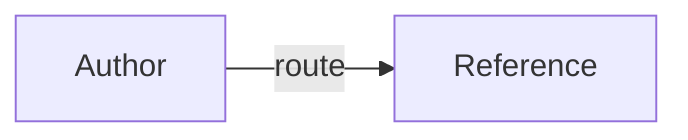

# Reference provenance

Use this package-local guide when an authored reference makes a claim that
needs a source, a freshness boundary, or a diagram syntax check. The labels
below are a normal Markdown source-record convention, not extra frontmatter or
a required custom schema.

## Definitions

- **Selector token**: the literal `/skill:name` notation for one catalog skill. It is
  not shell interpolation; use a catalog name and define it before its first
  use in a diagram or example.
- **Provenance**: the record of where a claim came from, what the claim covers,
  and how current or limited that source is.
- **GitHub-safe Mermaid label**: an edge label written as `-->|label|`, inside a
  fenced block whose language tag is `mermaid`.
- **Authored reference**: package-local guidance written for this skill. A
  source snapshot or generated frontmatter is source material, not authored
  guidance.

## Sources and references

Use an ordinary `## Sources` or `## References` section when a reference needs
citations. Keep the list or table close to the claims it supports. A compact
record uses familiar labels only when they help the reader:

```markdown
## Sources

- Source: [Provider documentation](https://example.com/guide)
  Scope: request fields and response behavior for version 2
  Accessed: 2026-08-14
  Status: verified for this review; recheck before making a current claim
```

Use `Source` for the URL or package-relative citation, `Scope` for the claim's
boundary, `Accessed` for the date a web page was consulted, and `Status` for a
clear qualifier such as `verified`, `historical`, or `UNVERIFIED`. Omit labels
that do not apply. If a supplied source was not consulted, preserve it as a
source lead and write `Status: UNVERIFIED` or `Source gap: not retrieved`.

Do not fabricate citations, dates, revisions, benchmark results, or authority.
Keep external snapshots unchanged; generated frontmatter and source snapshots
may retain their original headings and links and should not be rewritten as
authored guidance. In this package, `references/official/**`,
`references/generated/**`, `*.snapshot.md`, and `*.generated.md` are source
material rather than authored references.

## GitHub Mermaid guidance

GitHub renders Mermaid only when the diagram is inside a fenced code block with
the `mermaid` language identifier. Use simple node identifiers and the standard
edge-label form below; do not use the ambiguous `A -- label --> B` form.



Check the Mermaid version supported by the target GitHub surface before using
new syntax. A local Markdown preview or an unavailable renderer does not prove
GitHub rendering; report Mermaid rendering as `UNVERIFIED` unless it was
checked on a GitHub-compatible renderer.

## Sources

- Source: [GitHub Docs: Creating diagrams](https://docs.github.com/en/get-started/writing-on-github/working-with-advanced-formatting/creating-diagrams#creating-mermaid-diagrams)
  Scope: Mermaid fences and GitHub renderer-version guidance
  Accessed: 2026-08-14
  Status: verified for this review; the local renderer remains UNVERIFIED
- Source: [Agent Skills specification](https://agentskills.io/specification)
  Scope: portable skill directories, frontmatter, references, and progressive disclosure
  Accessed: 2026-08-14
  Status: verified for this review
- Source: [CommonMark specification](https://spec.commonmark.org/spec)
  Scope: Markdown headings, fenced code blocks, info strings, and links
  Accessed: 2026-08-14
  Status: verified for this review

The GitHub source does not establish this package's authored edge-label
convention; that conservative syntax is documented above without a fabricated
external citation.
