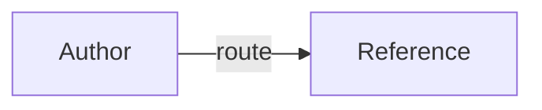

# Reference provenance

Use this package-local guide when an authored reference makes a claim that
needs a source, a freshness boundary, or a diagram syntax check. The labels
below are a normal Markdown source-record convention, not extra frontmatter or
a required custom schema.

## Definitions

- **Selector token**: the literal `$name` notation for one catalog skill. It is
  not shell interpolation; use a catalog name and define it before its first
  use in a diagram or example.
- **Provenance**: the record of where a claim came from, what the claim covers,
  and how current or limited that source is.
- **GitHub-safe Mermaid label**: an edge label written as `-->|label|`, inside a
  fenced block whose language tag is `mermaid`.
- **Authored reference**: package-local guidance written for this skill. A
  source snapshot or generated frontmatter is source material, not authored
  guidance.

## Source-record convention

Use an ordinary `## Sources` or `## References` section when a reference needs
citations. A compact table or list is enough; keep it close to the claims it
supports. Record these fields in prose or table columns when they apply:

| Field | Record |
| --- | --- |
| `authority_kind` | `primary`, `secondary`, `authored`, or `repository-policy`; distinguish an official specification from local guidance. |
| `claim_scope` | The exact subject, audience, version, and boundary; do not generalize beyond it. |
| `source_url` / `source_record` | A URL actually consulted, or a package-relative record such as `references/foo.md#sources`; use both when useful. |
| `retrieved_at` / `source_gap` | An ISO date for a consulted source, or a statement such as `source-gap: not retrieved` / `source-gap: local policy`. Local-policy records do not need a URL or date. |
| `source_revision` | A release, tag, commit, digest, or `unversioned web page` / `not applicable` when no immutable revision exists. Never invent one. |
| `status` | `active`, `historical`, or `unverified`; make stale or unrun evidence visible. |

Do not fabricate citations, retrieval dates, revisions, benchmark results, or
source authority. If a source was supplied but not consulted, preserve its URL
as a source lead and state the source gap. Keep external snapshots unchanged;
generated frontmatter and source snapshots may retain their original headings
and links and should not be rewritten as authored guidance. In this package,
`references/official/**`, `references/generated/**`, `*.snapshot.md`, and
`*.generated.md` are source material rather than authored references.

## GitHub Mermaid guidance

GitHub renders Mermaid only when the diagram is inside a fenced code block with
the `mermaid` language identifier. Use simple node identifiers and the standard
edge-label form below; do not use the ambiguous `A -- label --> B` form.

Check the Mermaid version supported by the target GitHub surface before using
new syntax. A local Markdown preview or an unavailable renderer does not prove
GitHub rendering; report Mermaid rendering as `UNVERIFIED` unless it was
checked on a GitHub-compatible renderer.

## Sources

| authority_kind | claim_scope | source_url / source_record | retrieved_at / source_gap | source_revision | status |
| --- | --- | --- | --- | --- | --- |
| primary | GitHub Mermaid fences and version-compatibility guidance | [GitHub Docs: Creating diagrams](https://docs.github.com/en/get-started/writing-on-github/working-with-advanced-formatting/creating-diagrams#creating-mermaid-diagrams) | 2026-08-14 | unversioned web page | active |
| primary | Portable skill directory, frontmatter, and progressive-disclosure conventions | [Agent Skills specification](https://agentskills.io/specification) | 2026-08-14 | unversioned web page | active |
| primary | Markdown headings, fenced code blocks, info strings, and links | [CommonMark specification](https://spec.commonmark.org/spec) | 2026-08-14 | unversioned web page | active |

The GitHub source does not establish this package's authored edge-label
convention; that conservative syntax is documented above without a fabricated
external citation.
